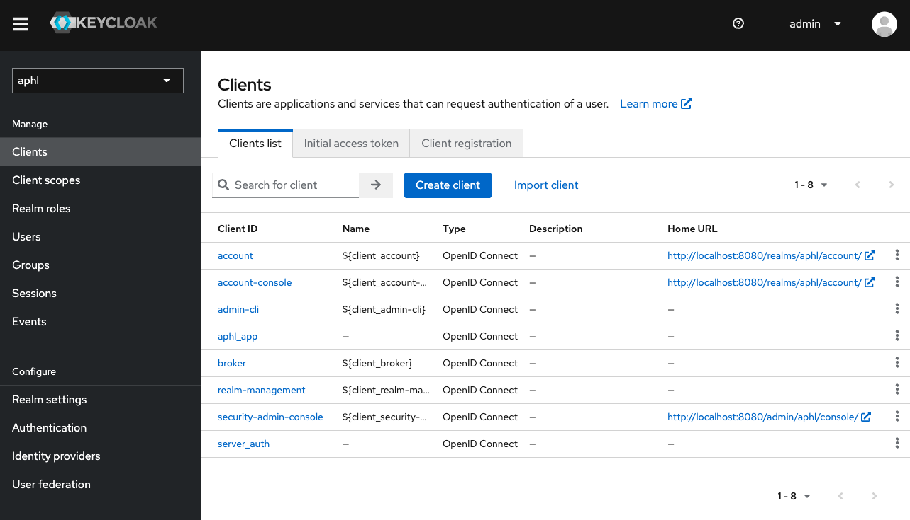

# aphl-vsm
ValueSet Manager Application

## Running the app in development
- *Make sure that Docker desktop is running.*

### Start up services in Docker (CQF-Ruler, Redis, Keycloak, Postgres)
- In root directory, run:
```docker-compose up```

### Seed sample data

- Load data to FHIR server (wait 30 sec/1min after you've run your `docker-compose up` before doing this for the server to be ready)
```bin/load-data.sh```

> IMPORTANT- notes about data:
> 
> The load-data program includes several conveniences that you will need to do manually if using Postman or cURL.
> It:
> - Loads many different static resources aside from demodata (SearchParameters, RCKMS Conditions, Endpoint resources, etc.)
> - Loads a special, manually-curated Parameters resource to the server, and inserts your ```FHIR_SERVER``` constant into the ```appAuthoritativeUrl``` before loading. This is necessary because:
> 1. The current eRSD has a known bug where it structures the ```compose.include``` items in the groupers incorrectly (fixed in that parameters resource).
> 2. The data *cannot currently be loaded via a plain POST to the server*. It needs to be ```POST``` to ```<FHIR server endpoint>/$eRSD-v2-import```, which adds necessary VSM-related metadata, such as profiles, usage contexts, etc. The ```load-data``` program does this
> 3. The ```appAuthoritativeUrl``` is your public fhir server URL on that environment. This is used in order to be able to generate the proper authoritativeSource extensions on resources that should be managed by VSM. Not having this will break the data.
>
> Remember that for Dev and QA deployments, you will need to load data with an authorization header. To do this via the ```load-data``` program, you can just set your AUTH_TOKEN const near the top of the file

### Run Keycloak to sign in to the app
- After you start up the dockerized services and load the data, wait a few minutes before running next steps
```./keycloak/configure```

- The configure file initializes some of the settings in Keycloak, adding a realm, admin role, etc.


### Edit some configuration in Keycloak UI
In order to connect your local Keycloak to the app, you must:
- navigate to http://localhost:8080 (Keycloak admin UI)
- enter admin username/pw (default: admin/admin)
- in dropdown top left, choose APHL, then click on clients at left. Select server_auth from Clients list


- Click on the credentials tab and copy the Client secret. You will need to add this to your .env.local in nextjs as the KEYCLOAK_SECRET:


- Add the following values to your .env.local:
```
# keycloak
# certain values must match the keycloak configure file
KEYCLOAK_ID=aphl_app
KEYCLOAK_SECRET=<KEYCLOAK CLIENT SECRET FROM SERVER_AUTH CLIENT>
KEYCLOAK_ISSUER=http://localhost:8080/realms/aphl
KEYCLOAK_REDIRECT_URI=http://localhost:3000/api/auth/callback/keycloak
```

- At this point, you should be able to run the app using the username johndoe and password password (if you didn't change the default values)

### Run the frontend application

##### Setup
> Keep in mind, to run the app, you will need a VSAC api username and key. You must sign up with them to receive this.

- If you don't have it already, copy .env.local.example to .env.local within `/vsm-app`
```cp vsm-app/.env.local.example vsm-app/.env.local```

- You must also run the following script to generate keys for the app BEFORE starting the application
```node generateKeyPair.js```

- Next run the following command to install the necessary dependencies for the Next.js app
```cd vsm-app && npm install```

- Finally to launch the the Next.js app run the following command:
```npm run dev```

To see the app UI, navigate to http://localhost:3000/

You will need to use the ```non_admin_username``` and ```non_admin_password``` that you defined in the ```./keycloak/configure``` file to log in.

### Clean up Docker Files in Development
- The Docker setup includes a Postgres volume that will persist even if you stop + kill containers.
- To clear *everything* out, run:
```bin/docker-cleanup```
- Note that this command will also delete anything related to your local CQF (HAPI) server for this project (and anything you have for other projects)

### Clear out CQF data only

- If you want to clear out the CQF data only, run:
```./bin/clear-data.sh```

By default this will point to the local instance of the CQF server running at `http://localhost:8082/fhir`, but you can override this by passing in a different URL as the first argument.


## Using a Development Build of clinical-reasoning

### `clinical-reasoning` Steps

Use `./mvnw clean install` to generate and cache a local version of your `clinical-reasoning` build

### `cqf-ruler` Steps

- Ensure that the pom.xml file has the right `clinical-reasoning` version variable:
```
		<clinical-reasoning.version>3.12.0-SNAPSHOT</clinical-reasoning.version>
```
or similar matching the version in your `clinical-reasoning` pom.xml file.
-  Use `./mvnw clean install` to generate and cache a local version of your `cqf-ruler` build containing the `clinical-reasoning` dependency
-  Use `docker build -t cqf-ruler-docker-image-tag-whatever .` to generate a docker image of `cqf-ruler` which you can use in the next part

### `aphl-vsm` Steps

- Make sure your `ecr/pom.xml` file has the correct versions of `clinical-reasoning`
```
<dependency>
			<groupId>org.opencds.cqf.fhir</groupId>
			<artifactId>cqf-fhir-cr</artifactId>
			<version>3.12.0-SNAPSHOT</version>
		</dependency>
		<dependency>
			<groupId>org.opencds.cqf.fhir</groupId>
			<artifactId>cqf-fhir-utility</artifactId>
			<version>3.12.0-SNAPSHOT</version>
		</dependency>
```
- Update your `docker-compose` file as follows:
```
cqf-ruler-vsm:
  image: something-different-to-what-it-was-before
  build:
   context: ./ecr
```
- Uodate the first line of `ecr/Dockerfile` as follows:
```
FROM cqf-ruler-docker-image-tag-whatever
```
where the base image is the cqf-ruler image you generated in the previous section.
- Then go to `ecr` and run `mvn clean install`
- In the base directory run `docker compose build` to copy your plugin files into the cqf-ruler image
- run `docker compose up` to start up your dev instance which will use the development build of `clinical-reasoning`
