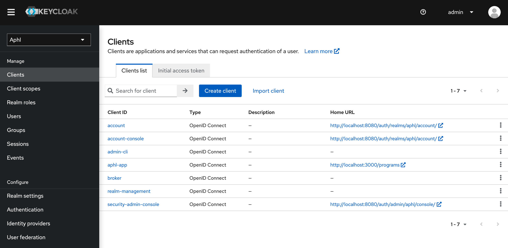
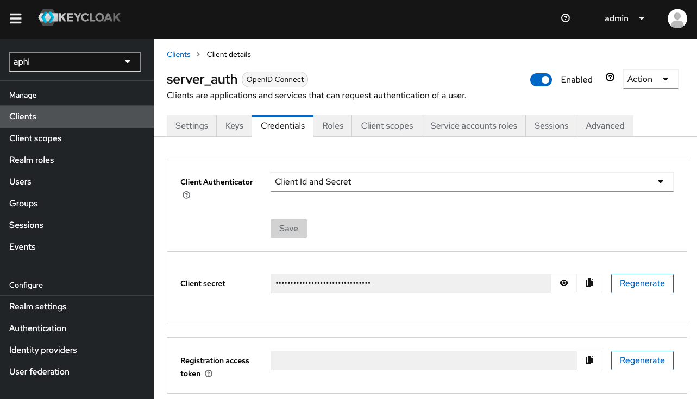
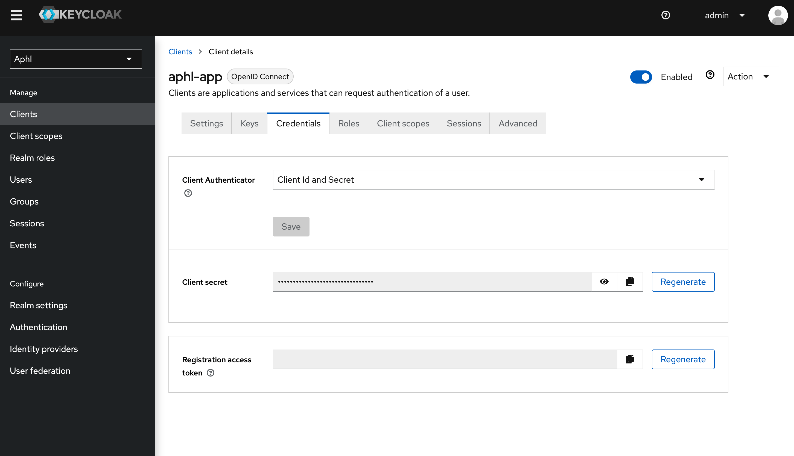

# aphl-vsm
ValueSet Manager Application

## Running the app in development

### Run the server + sample data
- Make sure that Docker desktop is running.

- Run the HAPI FHIR Server as detached process
```bin/run-fhir-server.sh```
The `baseURL` for the server in development is: `http://localhost:8080/fhir`

- Load data to FHIR server (wait 30 sec/1min before doing this for the server to be ready)
```bin/post-demo-data.sh```

### Run Keycloak to sign in to the app
- In ./keycloak, run:
```docker-compose up```
```./configure```
- The compose file will build + run the keycloak and postgres containers
- The configure file initializes some of the settings in Keycloak, adding a realm, admin role, etc.

### Edit some configuration in Keycloak UI
In order to connect your local Keycloak to the app, you must:
- navigate to http://localhost:8080 (Keycloak admin UI)
- enter admin username/pw (default: admin/admin)
- in dropdown top left, choose APHL, then click on clients at left. Select aphl-app from list


- On the settings page about halfway down, edit this block as seen here and PRESS SAVE:


- click on credentials. Copy the client secret. You will need to add this to your .env.local in nextjs


- Add the following values to your .env.local:
```
# keycloak
# certain values must match the keycloak configure file
KEYCLOAK_ID=aphl-app
KEYCLOAK_SECRET=<YOUR LOCAL KEYCLOAK SECRET>
KEYCLOAK_ISSUER=http://localhost:8080/auth/realms/aphl
KEYCLOAK_REDIRECT_URI=http://localhost:3000/api/auth/callback/keycloak
```

- At this point, you should be able to run the app using the username johndoe and password password (if you didn't change the default values)

### Run the frontend application
- If you don't have it already, copy .env.local.example to .env.local within `/vsm-app`
```cp vsm-app/.env.local.example vsm-app/.env.local```

- keep in mind, the VSAC api requires a username and key. You must sign up with them to receive this.

- Run the Next.js app
```cd vsm-app && npm install && npm run dev```

To see the app UI, navigate to http://localhost:3000/

You will need to use the ```non_admin_username``` and ```non_admin_password``` that you defined in the ```./keycloak/configure``` file to log in.

### Clean up Docker Files in Development
- The Docker setup includes a Postgres volume that will persist even if you stop + kill containers.
- To clear *everything* out, run:
```bin/docker-cleanup```
- Note that this command will also delete anything related to your local CQF (HAPI) server for this project (and anything you have for other projects)
