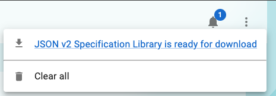
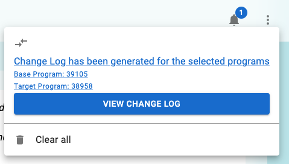

In VSM we currently have several operations that run async and utilize a redis queue to perform them.
The underlying framework for async jobs utilizies [Bull](https://github.com/OptimalBits/bull) which is a Redis-backed queue library. The library is used to create a queue for each type of job that needs to be run asynchronously. Most jobs are currently set to run one at a time given we don't have a large volume of users.

These jobs are divided into two categories, jobs that are part of the notification system and jobs that are not.

**Data Modeling**

There are two data structure for Jobs modeled in this feature, one defined by us and seen in jobTypes.ts supports the notification system and the other are the Bull Job objects that are used to store the completed result for the jobs.

Example Bull data
```json
{
    "id": "40",
    "name": "__default__",
    "data": {
        "data": {
            "parameters": {
                "resourceType": "Parameters"
            },
            "json": true,
            "useV2": true
        },
        "programId": "38958",
        "userId": "bb661fbe-82f5-4794-9da9-8d42a25e661c"
    },
    "opts": {
        "removeOnComplete": {
            "age": 86400
        },
        "removeOnFail": {
            "age": 86400
        },
        "attempts": 1,
        "delay": 0,
        "timestamp": 1737768411735
    },
    "progress": 100,
    "delay": 0,
    "timestamp": 1737768411735,
    "attemptsMade": 0,
    "stacktrace": [],
    "returnvalue": {
        "response": { Removed for brevity },
        "validationResults": [ Removed for brevity ]
    },
    "finishedOn": 1737768429365,
    "processedOn": 1737768411740
}

```

Example of VSM job data
```json
jobId: "40"
metadata: "{\"programId\":\"38958\",\"version\":\"v2\",\"hasCustomPlanDefinition\":false,\"isJson\":true,\"filename\":\"Specification-Library-bundle_2025-01-24_15-26-51.json\",\"programTitle\":\"Specification Library\"}"
status: "IN_PROGRESS"
type: "EXPORT"
```


**Jobs that are part of the notification system:**
Metadata is associated with each of these notification jobs and can be find in the types file of jobTypes.ts. The metadata is set on the server side

- Program Export:
  
  Programs can be exported from the CQF-ruler service as either XML or JSON file. 
  The export operation is performed asynchronously and the user is notified when the export is complete. Upon completion the user can click the notification menu item to initiate the download of two files, the exported program and the validation results of the program.

- Generating a comparison Change Log

  The comparison change log is generated when a user compares two versions of a program. Upon completion the user can click the notification menu item and view the program comparisons directly. In order to save on re-computing the comparison, we retrieve the comparison from the Bull job cache and display it to the user.
  Any changes to either program will result in a new updated datetime

**Independent Jobs:**
- Updating the CQF Ruler Cache for all the valuesets within a program
  In a draft program the user has the ability to update the cqf-ruler cache with the latest valuesets from VSAC.
  This operation is performed asynchronously and the user is notified when the operation is complete on the same page. It is important to note 
  that this WILL not update the valuesets in the program itself. 

- Downloading dependent valuesets
  Upon adding a Valueset to a program from VSAC, the VSM app will scan for any dependencies of that valueset and add them to the cqf ruler cache and thus will help expedite the program export process.